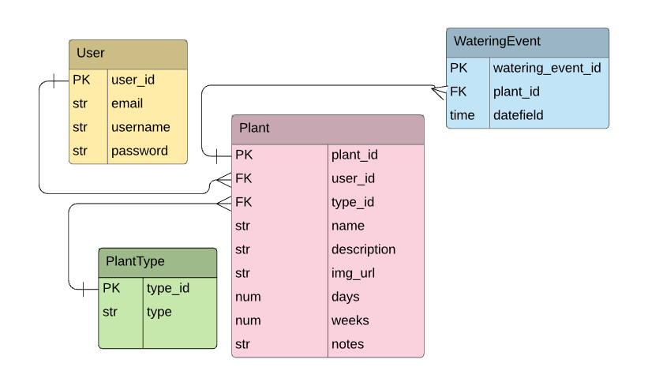

# PlantPal: A Watering Reminder App

::Gif Demo coming soon...::

## An App for Thirsty Plants Everywhere

PlantPal is an app that reminds users when to water their plants. Users can save their plants to the database, log how often their plants need to be watered, and be informed when it’s time. Marking plants as watered resets the time so users can do it all over again.

## Why I Built This

I can't tell you exactly how many houseplants I've killed, but it's a lot. Most. All? Basically, I've overwatered many a succulent and underwatered many a flower. That's also a story I've consistently heard from other people. I love having plants in the house and decided that our plants deserve better. That's when Plant Pal was born.

Technologies used: Python, Django, Bootstrap (in the form of Bootswatch), Visual Studio Code, SQLite, GitHub, DBeaver

## Instructions for Using PlantPal

1. In your terminal, clone down the repo: 
`git@github.com:erinepolley/Capstone-Back-End.git`
2. Cd into the repo: `cd plantpal`
3. Create a virtual environment:
Windows:
`python -m venv capstoneEnv`
`source ./capstoneEnv/Scripts/activate`
Mac:
`python -m venv capstoneEnv`
`source ./capstoneEnv/bin/activate`
4. Install dependencies: `pip install -r requirements.txt`
5. Create a database:
`python manage.py makemigrations`
`python manage.py migrate`
6. Load "plant type" data in database from fixtures:
`python manage.py loaddata plant_type.json`
7. Run the server: `python manage.py runserver`
8. Navigate to http://localhost:8000/ 
9. Enjoy worry-free watering of your houseplants!

## Plant Pal Entity Relationship Diagram

