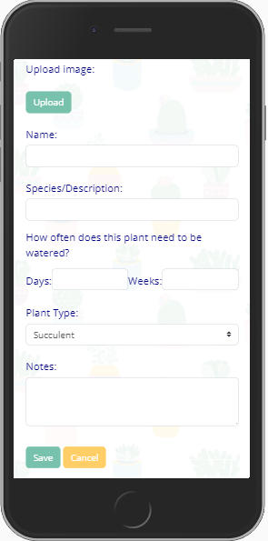
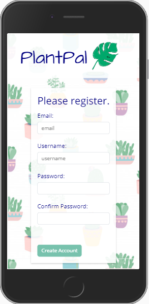

# PlantPal: A Watering Reminder App

## An App for Thirsty Plants Everywhere

PlantPal is an app that reminds users when to water their plants. Users can save their plant information and photos to the database (as well as edit and delete them), log how often their plants need to be watered, and be informed on the correct day when to water the correct plants. When users mark plants as watered, it effectively starts the countdown over. 
<pre>                            </pre>

## Why I Built This

I can't tell you exactly how many houseplants I've killed, but it's a lot. Most. All? Basically, I've overwatered many a succulent and underwatered many a flower. That's also a story I've consistently heard from other people. I love having plants in the house and decided that our plants deserve better. That's when PlantPal was born.

Technologies used: Python, Django, SQLite, JavaScript. Cloudinary, GitHub, Bootstrap (in the form of Bootswatch), Visual Studio Code, DBeaver
<pre>                  </pre>

## Instructions for Using PlantPal

1. In your terminal, clone down the repo: 
`git@github.com:erinepolley/Capstone-Back-End.git`

1. Cd into the repo: `cd plantpal`
1. Create a virtual environment:  
Windows:
  - `python -m venv capstoneEnv`
  - `source ./capstoneEnv/Scripts/activate`  
Mac:
  - `python -m venv capstoneEnv`
  - `source ./capstoneEnv/bin/activate`
1. Install dependencies: `pip install -r requirements.txt`
1. Create a database:
  - `python manage.py makemigrations`
  - `python manage.py migrate`
1. Load "plant type" data in database from fixtures:
  - `python manage.py loaddata plant_type.json`
1. Run the server: `python manage.py runserver`
1. Navigate to http://localhost:8000/ 
1. Enjoy worry-free watering of your houseplants!

## PlantPal Entity Relationship Diagram

